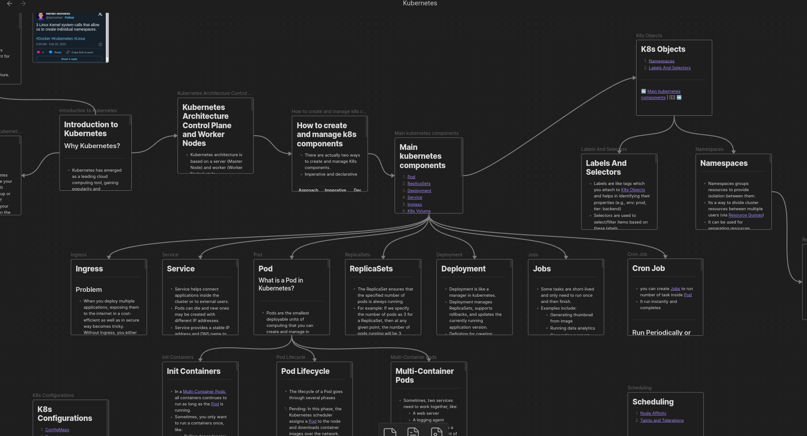

# kubernetes-map

## Idea
- The Idea of the project is to create a [second brain](https://fortelabs.com/blog/basboverview/) for kubernetes.
- Map View
- 
- Graph View
- 

## Installation
- Clone the git repository into your local machine
- To setup the vault in your machine you will require to download [obsidian](https://obsidian.md/)
- Click on `Open folder as vault` and select the repository
- Go to `Setting` -> `Community Plugins`   and Turn off Restricted mode
- To use this vault with GitHub go to `Setting` -> `Community Plugins` -> `Browse` -> `Obsidian git` and Install it.
- You can read the [documentation](https://publish.obsidian.md/git-doc) for obsidian-git and customize the git configuration according to your need.

## Contributing
- Go to `Setting` -> `Core Plugins` -> `Templates` and Enter `Templates` in folder location
- Add new note, insert template from left sidebar and grow, link and cultivate the thoughts.